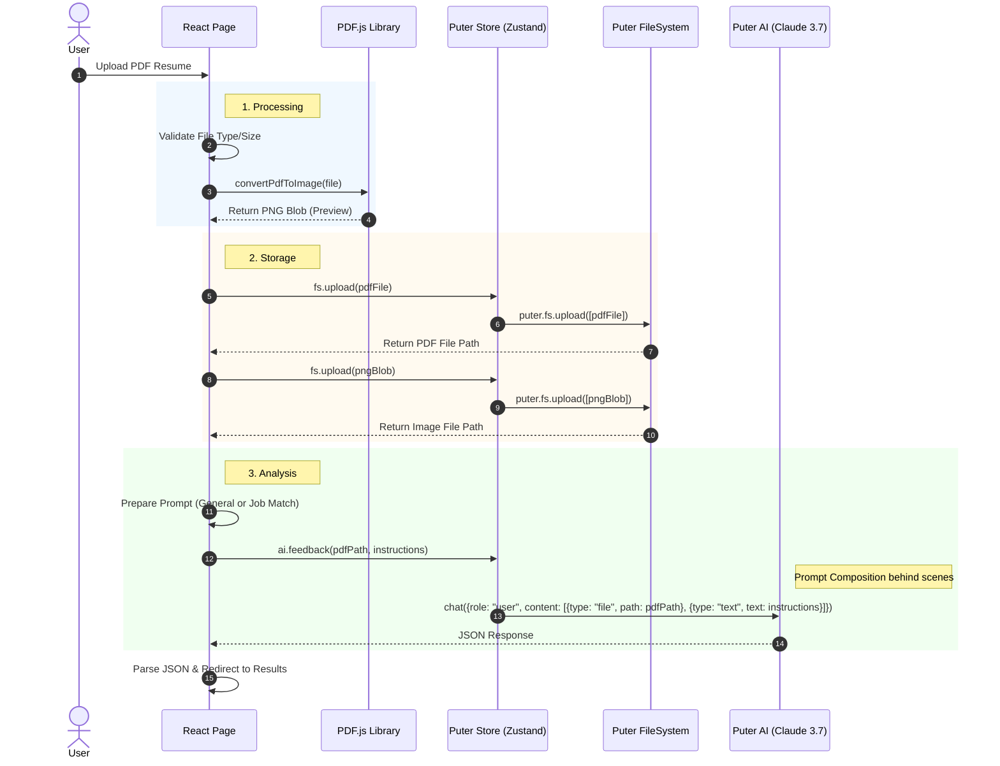
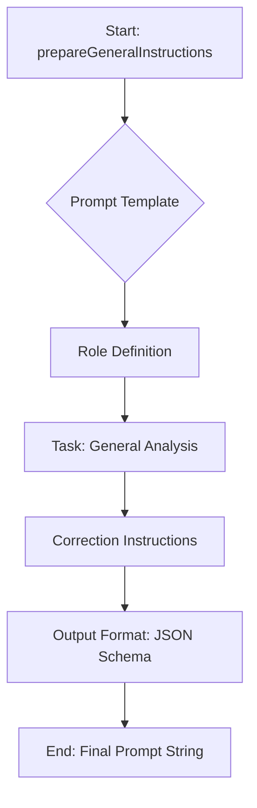
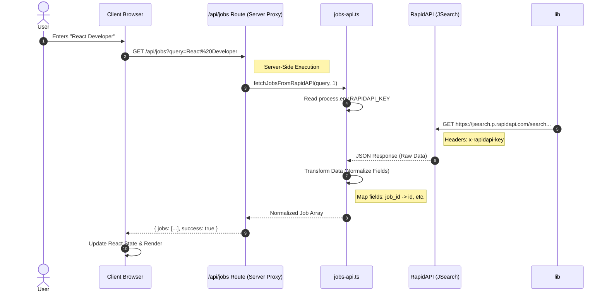
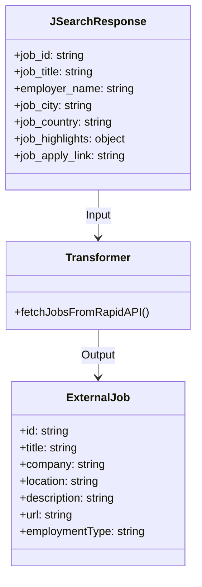

# Detailed AI & API Workflows

This document provides in-depth technical details about how the application handles AI analysis and external API data fetching.

## 1. AI Analysis Workflow

The application uses **Puter.js AI** (powered by Claude 3.7 Sonnet) to analyze resumes. The analysis is performed entirely on the client-side (via Puter's backend proxy).

### 1.1. Analysis Process Sequence



### 1.2. Prompt Engineering Structure

The prompts are dynamically constructed in `app/constants/index.ts`.

#### General Analysis Prompt
Used when the user simply uploads a CV without a specific job description.



**Key Components:**
*   **Role**: "Expert in resume analysis"
*   **Extraction**: Name, Email, Phone, Current Title
*   **Format**: Strict JSON structure enforcement
*   **Language**: Enforce English output

#### Job Match Prompt
Used when comparing a CV against a specific Job Description (JD).

```mermaid
graph TD
    A[Start: prepareInstructions(jobTitle, jobDescription)] --> B{Prompt Template}
    B --> C[Role Definition]
    C --> D[Context Injection]
    D --> D1[Inject content of jobTitle]
    D --> D2[Inject content of jobDescription]
    D --> E[Analysis Logic]
    E --> E1[Extract Candidate Info]
    E --> E2[Extract JD Requirements]
    E --> E3[Compare & Score]
    E --> F[Output Format: JSON Schema]
    F --> G[End: Final Prompt String]
```

## 2. API Data Fetching (Job Search)

The application fetches job listings from the **JSearch API (via RapidAPI)**. To protect API keys (when needed) and manage CORS, the request is routed through a Remix/React Router resource route.

### 2.1. Job Fetching Sequence



## 3. Data Transformation

Raw data from external APIs is never used directly in the UI. It passes through a transformation layer.


