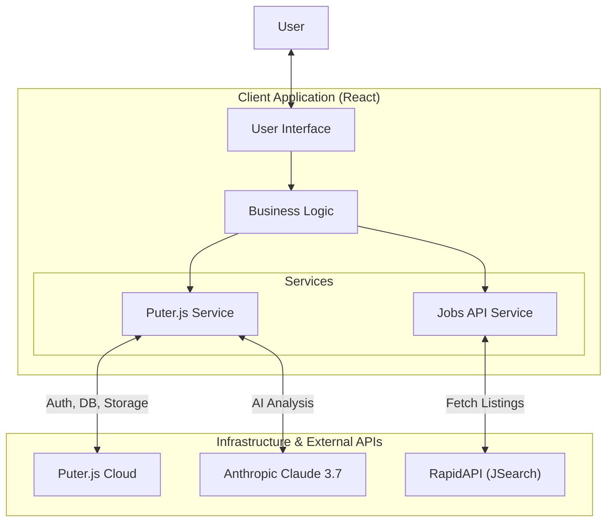
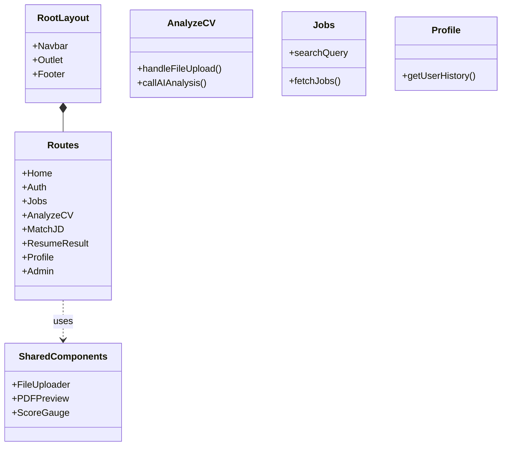
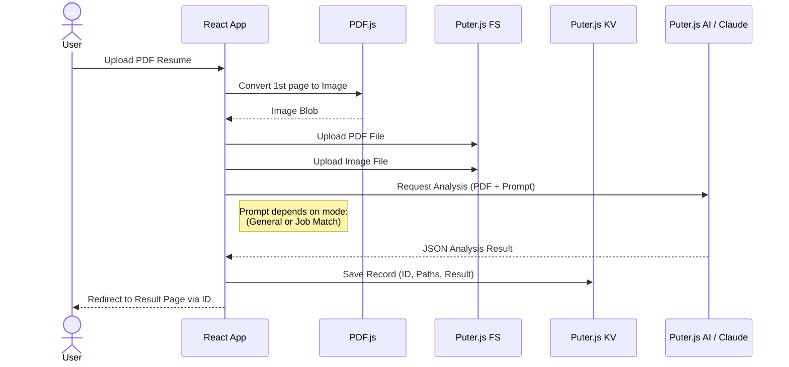
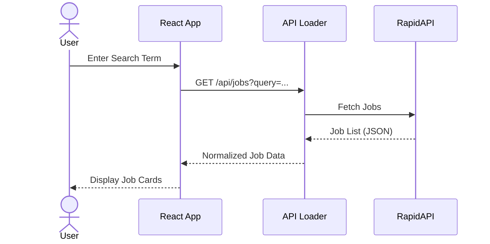

# Project Structure & Architecture

This document outlines the structure and architecture of the **AI Resume Analysis** application.

## 1. File Structure

```text
├── app/
│   ├── components/
│   │   ├── features/       # Feature-specific components (Chat, Cover Letter)
│   │   ├── layout/         # Layout components (Navbar, Footer)
│   │   ├── resume/         # Resume analysis display components
│   │   └── ui/             # Reusable UI elements (Buttons, Uploaders)
│   ├── hooks/              # Custom React hooks (useResumeData, etc.)
│   ├── lib/                # Core utilities and services
│   │   ├── jobs-api.ts     # RapidAPI integration
│   │   ├── pdf2img.ts      # PDF processing
│   │   └── puter.ts        # Puter.js integration (Auth, DB, Storage, AI)
│   ├── routes/             # React Router pages
│   │   ├── admin/          # Admin dashboard
│   │   ├── analyze-cv.tsx  # General analysis flow
│   │   ├── match-jd.tsx    # Job matching flow
│   │   ├── jobs.tsx        # Job search page
│   │   └── ...
│   └── root.tsx            # Application root
├── public/                 # Static assets
└── docs/                   # Documentation
```

## 2. System Architecture

The application is a client-side React app (using React Router v7) that leverages **Puter.js** as a Backend-as-a-Service solution for all server-side capabilities, eliminating the need for a traditional backend server.



## 3. Component Architecture

Structure of the main application routes and their relationships.



## 4. Key Workflows

### 4.1. Resume Analysis Flow

This diagram illustrates how a resume is processed from upload to analysis.



### 4.2. Job Search Flow


